# kmesh-mcp-poc

This is a mcp server built as a proof of concept towards my LFX '26 term 3 proposal for [kmesh-net/kmesh#1800](https://github.com/kmesh-net/kmesh/issues/1800) and I have **tested this via claude code mcp plugin against a real kmesh cluster** in my local machine using kind.

This mcp server allows an AI assistant to read the state of a kmesh service mesh as mentioned in the issue. Since this is an user facing entity that helps to communicate with KMesh infrastructure very similar to Kmeshctl; I have drawn a fair amount of inspiration from it like fanout to all daemon nodes, port-forwarding through k8s api etc for building this mcp server.

## Running it

You need a cluster running kmesh and a kubeconfig that can reach it. The server resolves credentials the same way `kubectl` does, so whatever `kubectl get pods -n kmesh-system` works with is enough.

Start the server from this directory:

```bash
go run ./cmd/kmesh-mcp
```

It listens on `localhost:8080/mcp`. Pass `--listen` to change that:

```bash
go run ./cmd/kmesh-mcp --listen localhost:9090
```

The kubeconfig it runs with needs to list and get pods in `kmesh-system`, create `pods/portforward` there, list namespaces, and create `tokenreviews`. The last one is how it checks the caller's token.

### Adding it to Claude Code

The server expects a Kubernetes service account token in the `Authorization` header, so mint one and pass it when registering the server:

```bash
TOKEN=$(kubectl -n kmesh-system create token <service-account>)

claude mcp add --transport http kmesh http://localhost:8080/mcp \
  --header "Authorization: Bearer $TOKEN"
```

Any service account token the cluster recognises will work. The server verifies that the token is real, not that the caller is allowed to reach the daemons, which is the limitation described under [Authentication](#authentication).

Check it connected:

```bash
claude mcp list
```

Then ask the assistant something like `what version is kmesh running` and it will call `kmesh_version`. There are more examples with the actual output further down.

## MCP Specs
| | |
| --- | --- |
| SDK | `github.com/modelcontextprotocol/go-sdk` v1.7.0 |
| Protocol revision | `2026-07-28`, negotiated per request. The SDK also accepts `2025-11-25`, `2025-06-18`, `2025-03-26` and `2024-11-05`, so older clients still connect |
| Transport | Streamable HTTP, `POST /mcp` |
| Session model | stateless: no `Mcp-Session-Id` is read or written, and every request stands alone |
| Response encoding | `application/json` rather than SSE framing, since nothing here streams |
| Capabilities used | tools only |
| Structured output | yes. Each tool returns a concrete Go type, so the SDK derives an output schema and fills `structuredContent` |
| Auth | bearer token, checked by the SDK's `RequireBearerToken` middleware in front of the handler |

## Why a separate module?
i. The official go-mcp-sdk requires go v1.25.0 but the kmesh is declared 1.24.2; so we cannot have it in the same module currently unless we bump kmesh to go v1.25.0.</br>
ii. kmesh cannot be imported as a library at any version newer than January 2025 so we have to have them in the same repo to use the up to date code.

## How it connects to kmesh daemons
Kmesh runs one daemon per node and each daemon answers only about its node. The admin api is also bound to `localhost:15200` so the only way is port-forward through k8s API; very similar to how kmeshctl does this.

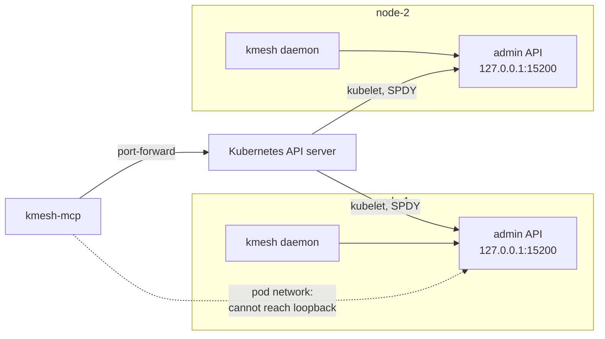
In the above the dotted arrow depicts a mcp server out of the cluster cannot directly contact the kmesh admin api as the admin loopbacks inside its own pod's network namespace and is unreachable over the pod network, from anywhere, including another pod on the same node. That is also the reason why this server inside the cluster would not avoid the tunnel.

So because of this, the server looks up for the daemon pods, opens a tunnel and merges the answers. Since it is very similar to kmeshctl, the server uses the kmesh's own client and port-forwarder rather than a hand-written HTTP client.

## Authentication
Kmeshctl's client directly reads the creds like how `kubectl` does i.e. `KUBECONFIG`, `~/.kube/config`, then an in-cluster service account. The mcp server follows a similar approach, but the drawback here is that anyone who reaches the server can access its capabilities. So an auth at server is required and the server uses bearer token based authentication.
```http
Authorization: Bearer <token>
```
So here instead of having a dedicated token based authentication system on the server, we are opting to take service account tokens in the bearer and validate it against kubernetes API; so a missing or an invalid token returns 401.</br>
On the whole the token in the request header is just used for verifying the user while the real request is made via the creds stored on the server similar to kmeshctl. But the drawback here is that someone who couldn't port forward themselves with token to kmesh daemon themselves can see an answer via the server.

### Why are we not using the same caller's token sent in the request as a part of auth for port forwarding?

Using the caller's token seems to be the better option here but the major reason for this is that in the current kmesh helpers that is only half supported.</br>
i. the Kubernetes API calls could use the caller's token. </br>
ii. the port-forward can't. kmesh's forwarder builds its credentials from `clientFactory`, a field on an unexported struct in pkg/kube, and nothing outside that package can set it. ClientOption doesn't help either: it gets the client as an interface, and its return value is thrown away.
So we have to either write our own port forwarder or have `pkg/kube` accept a bearer token that reaches both the REST config and the config-flags object the forwarder builds from.

## The Request Flow

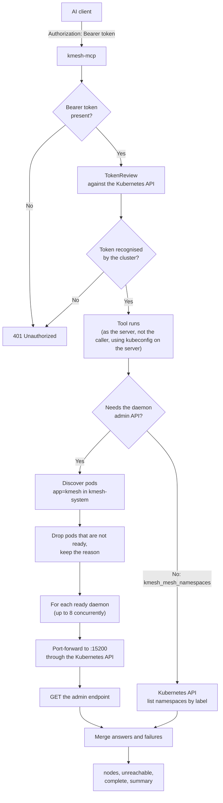

Note: This diagram depicts the flow in this PoC, originak server will continue to use the user's service account token if agreed upon.

## Things that are reused from existing kmesh

As mentioned earlier, kmeshctl also contacts the admin api, we reuse four packages so nothing is reimplemented that kmesh already exports:

| From kmesh | Used for |
| --- | --- |
| `ctl/utils.CreateKubeClient` | building the Kubernetes client, same call `kmeshctl` makes |
| `ctl/utils.CreateKmeshPortForwarder` | opening the tunnel to a daemon's admin port |
| `ctl/utils.KmeshNamespace`, `KmeshLabel`, `KmeshAdminPort` | where the daemons live and which port to hit |
| `pkg/kube.CLIClient`, `pkg/kube.PortForwarder` | the interfaces everything here is written against |
| `pkg/version.Info` | the shape `/version` returns |
| `pkg/constants.DataPlaneModeLabel` | the mesh enrolment label |

There are other packages that could be reused but were specifically made for kmeshctl and do not accurately support our mcp server or just aren't exported. We could rewrite/expand/export some of those helpers upstream so that we could reuse them in both. These are listed below:
- **The fan-out**, because there isn't one. `ctl/utils` exports exactly two
  functions, make a client and make a tunnel. The four commands that need to ask
  every daemon each write their own loop, and they disagree about failures:
  `version` returns an empty struct that the caller then filters away. So the node
  silently vanishes from the count; `authz status` logs and continues, so it's
  absent from the printed table; `authz` enable/disable calls `os.Exit(1)`
  part-way through the loop, leaving earlier nodes changed and later ones
  untouched. They don't even loop over the same type, and none of them return
  data, so there's no `(T, error)` anywhere to build on. They're also all
  sequential: not one goroutine in any daemon fan-out, so `kmeshctl version` on a
  twenty-node cluster opens and tears down twenty tunnels one after another.
  `Ask` here runs them concurrently, capped at eight tunnels at a time, and
  returns per-node results alongside per-node failures. None of the CLI's choices
  are wrong for a CLI, where a person runs one command and reads a table; they
  stop working when the caller is a server answering an assistant.

- `ctl/log.GetJson` does the fetch and decode we need but it uses `http.Get` and
  Go's default client has no timeout, so nothing can cancel it which would work for cli as we can just do CTRL+C to stop it but the same could hang forever if we use that in a tool inside our mcp server.

- `LoggerInfo` exists twice in kmesh and neither copy can be used. `pkg/status`
  needs generated eBPF objects to build at all, and `ctl/log` reaches
  `github.com/cilium/ebpf` through `pkg/logger`, which is a lot of dependency for
  two strings. So there's a third copy here, for the same reason the other two
  exist.
 
- The pod readiness check and the admin API route constants are unexported.

## Some additional features in this mcp server considering how large language models understand the data and how could we leverage more performance and UX.
* We do not drop the daemons that we were not able to reach or which errored out. Instead we include `unreachable` field in our tool result which contains the information of all unreachable daemons. Similarly we include all the daemons that errored out as well with the reason they errored out. Also an additional `complete` field.

* Each tool returns an additional `summary` field which is one plain sentence next to the data. It is generated from the same counts that fills `nodes` and `unreachable`. It exists because when an LLM gets structured fields and it has to write the response for the user it may skim over the data and just see `complete` field or may get the entire count of `nodes`, `unreachable` and the ones that succeeded or errored out wrong.

* In Fan out since the results of all the daemons are independent of each other, instead of calling each daemon sequentially we use concurrency (max 8 go routines in this poc) and merge those results in the final output.

## Tools exposed in this server

| Tool | Arguments | What it answers |
| --- | --- | --- |
| `kmesh_version` | `pod_name` (optional) | the build version of every daemon, and whether they agree |
| `kmesh_loggers` | `name`, `pod_name` (both optional) | log levels across the fleet, and whether nodes disagree |
| `kmesh_mesh_namespaces` | none | which namespaces are in the mesh, and in which mode |

## Tool output

The outputs here are not synthetic nor generated by me; these are generated from test suite. The wordings and the structure are validated using an actual server run.

`kmesh_version` on a three-node cluster where one daemon refuses the tunnel and
another is still starting up. Note that both are still named, with the reason
```json
{
  "complete": false,
  "nodes": [
    {
      "node": "node-1",
      "pod": "kmesh-4kx9m",
      "value": { "gitVersion": "v1.2.0", "gitCommit": "abc123" }
    },
    {
      "node": "node-2",
      "pod": "kmesh-8vn2q",
      "error": "opening tunnel to kmesh-8vn2q: connection refused"
    }
  ],
  "unreachable": [
    { "node": "node-3", "pod": "kmesh-p2r7t", "reason": "ContainersNotReady" }
  ],
  "summary": "1 of 3 daemons answered; 1 failed, 1 was not reachable; those that answered are on v1.2.0"
}
```

`kmesh_loggers` for one logger, on a cluster where somebody left a node on debug:

```json
{
  "complete": true,
  "logger": "dns_resolver",
  "nodes": [
    {
      "node": "node-1",
      "pod": "kmesh-4kx9m",
      "value": { "levels": { "dns_resolver": "info" } }
    },
    {
      "node": "node-2",
      "pod": "kmesh-8vn2q",
      "value": { "levels": { "dns_resolver": "debug" } }
    }
  ],
  "summary": "all 2 daemons answered; levels differ across nodes for dns_resolver (debug, info)"
}
```

`kmesh_mesh_namespaces`, which doesn't contact a daemon at all:

```json
{
  "namespaces": [
    { "name": "legacy", "mode": "none" },
    { "name": "payments", "mode": "Kmesh" },
    { "name": "shop", "mode": "Kmesh" }
  ],
  "summary": "2 namespaces enrolled in the mesh (payments, shop); 1 explicitly opted out (legacy)"
}
```

## Actual run against a real cluster and claude code

### 1. Adding the mcp server to claude code

Using the commands from [Running it](#running-it). Claude Code stores the header and prints it back as `[REDACTED]`. The token is greyed out in the screenshot below for the same reason.

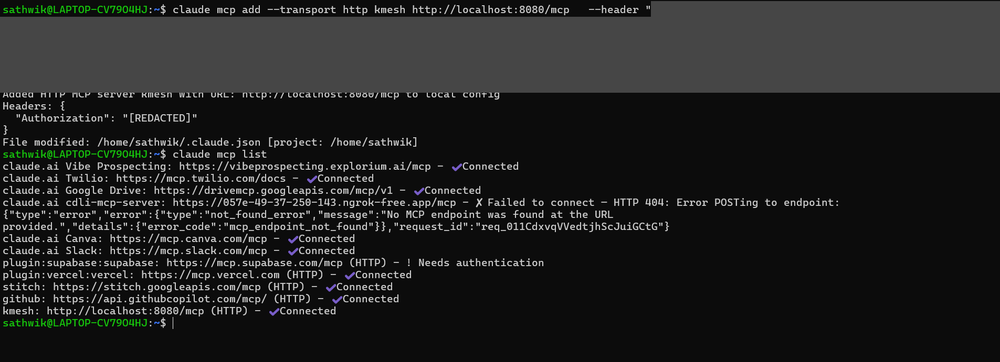

### 2. `kmesh_version`
#### i. with all nodes are on the same version.  
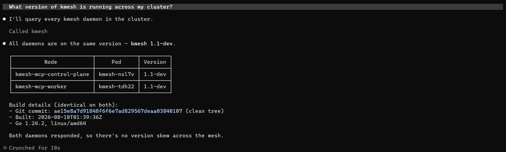 
</br> </br>
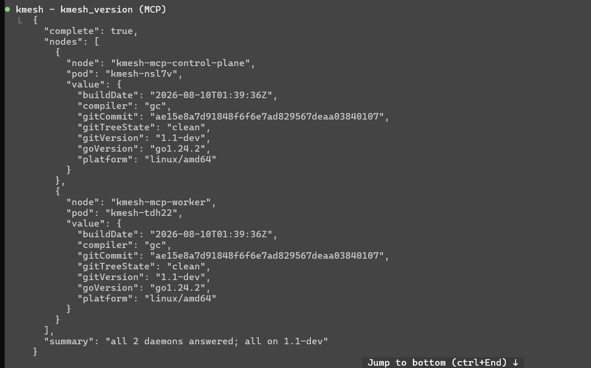

#### ii. With `pod_name` parameter.
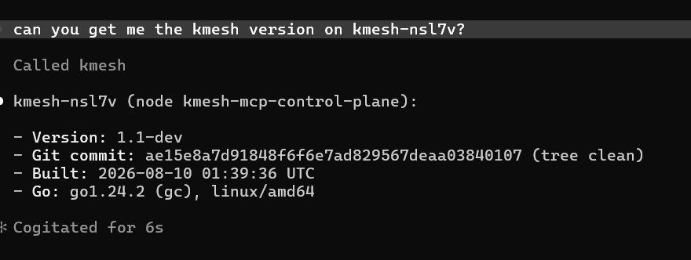 
</br> </br>
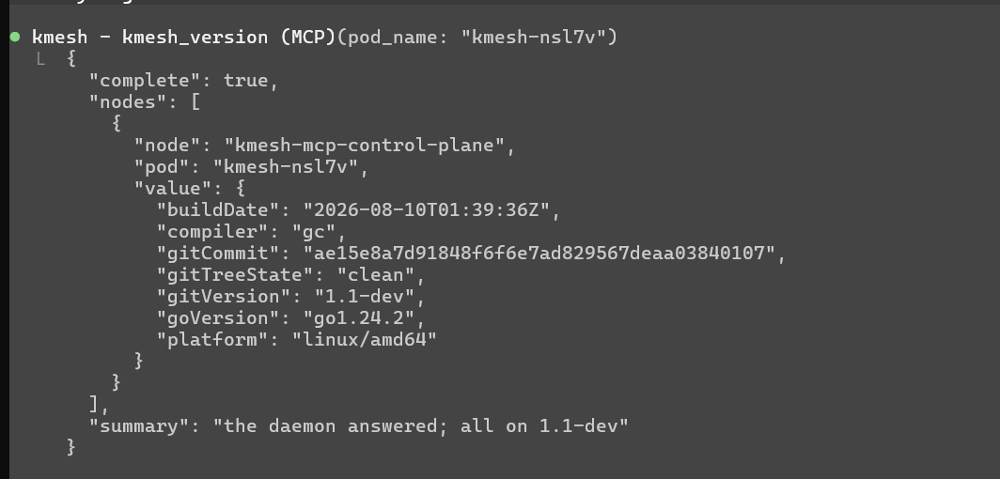

### 3. kmesh_loggers 
#### i. With every logger at the same level
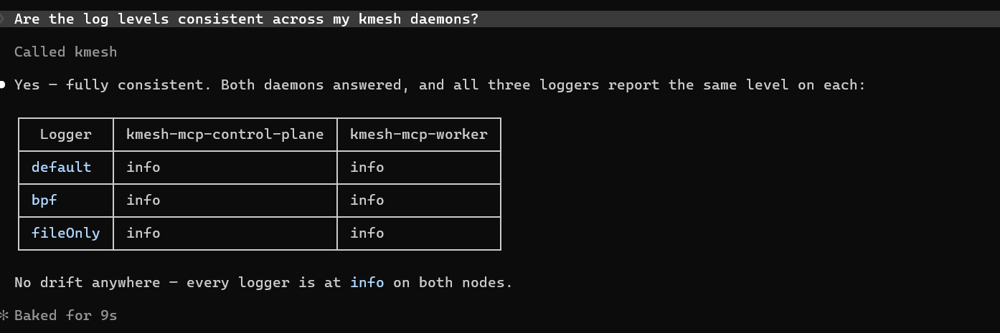 
</br> </br>
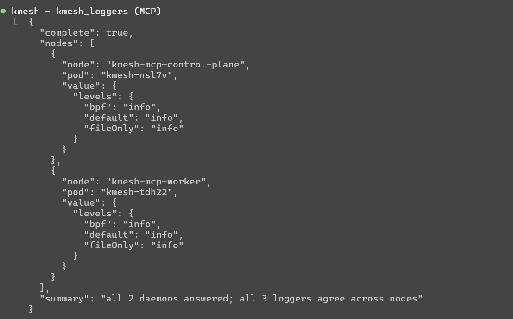

#### ii. With `pod_name` parameter.
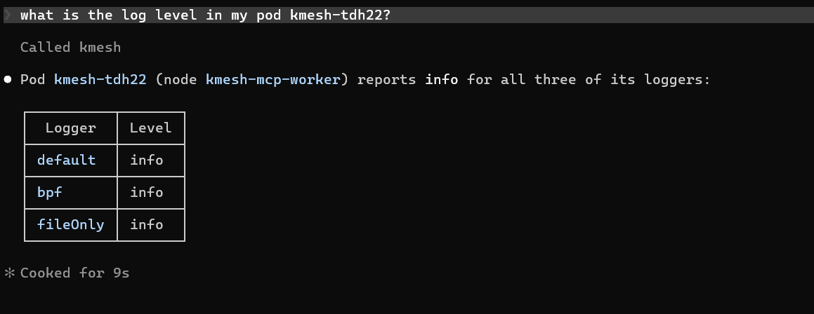 
</br> </br>
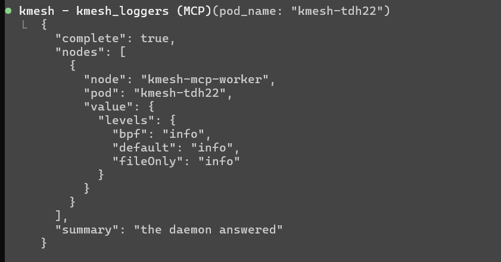

#### iii. With `name` arg
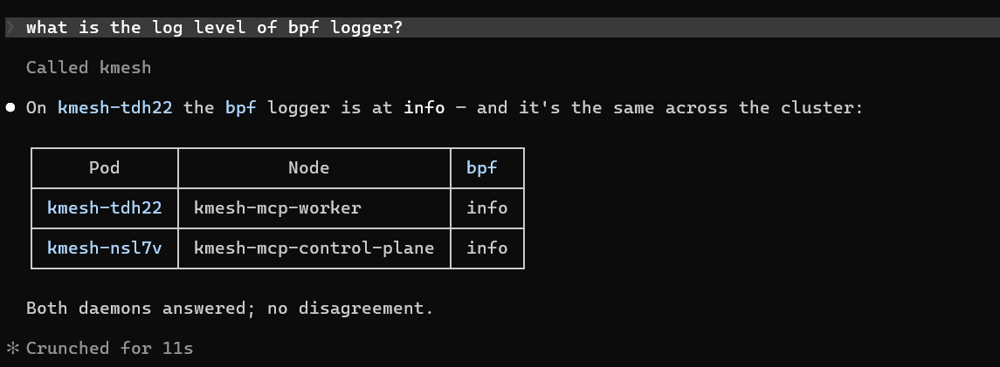 
</br> </br>
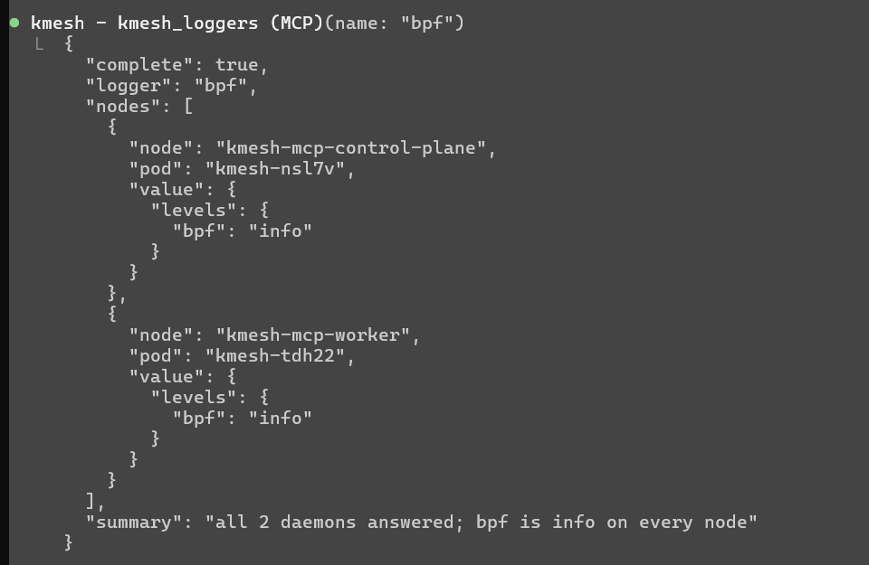

#### iv. With a non existing logger.
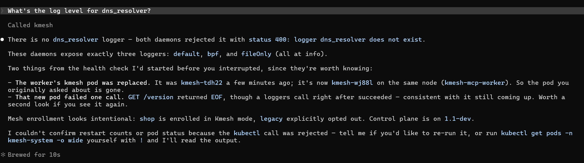 
</br> </br>
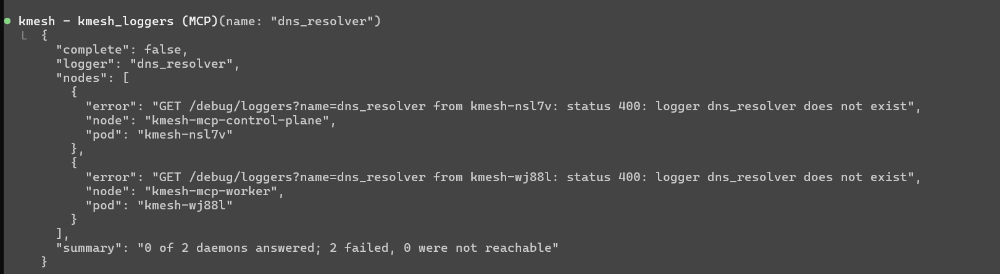

### 4.`kmesh_mesh_namespaces` 
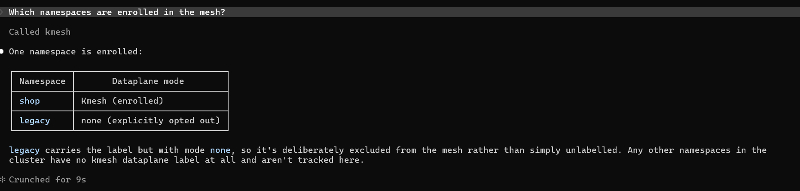
</br> </br>
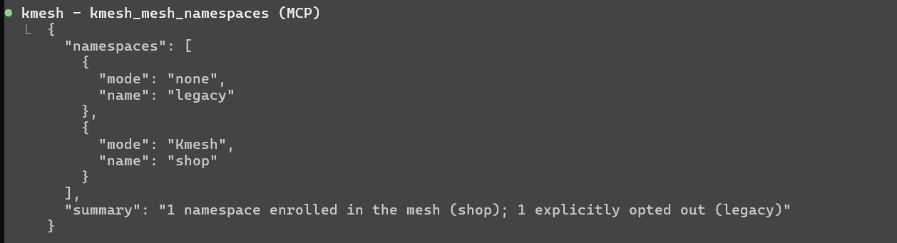

